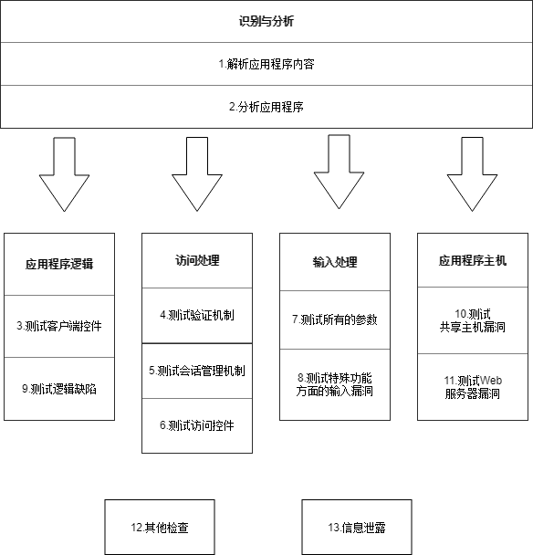

# 红方手册

## Web应用测试通用方法论

> 参考《黑客攻防技术宝典：Web实战》

### 1.解析应用程序内容

### 2.分析应用程序

### 3.测试客户端控件

### 4.测试验证机制

### 5.测试会话管理机制

### 6.测试访问控件

### 测试所有的参数

### 8.测试特殊功能方面的输入漏洞

### 9.测试逻辑缺陷

### 10.测试共享主机的漏洞

### 11.测试Web服务器的漏洞

### 12.其他检查

### 13.信息泄露